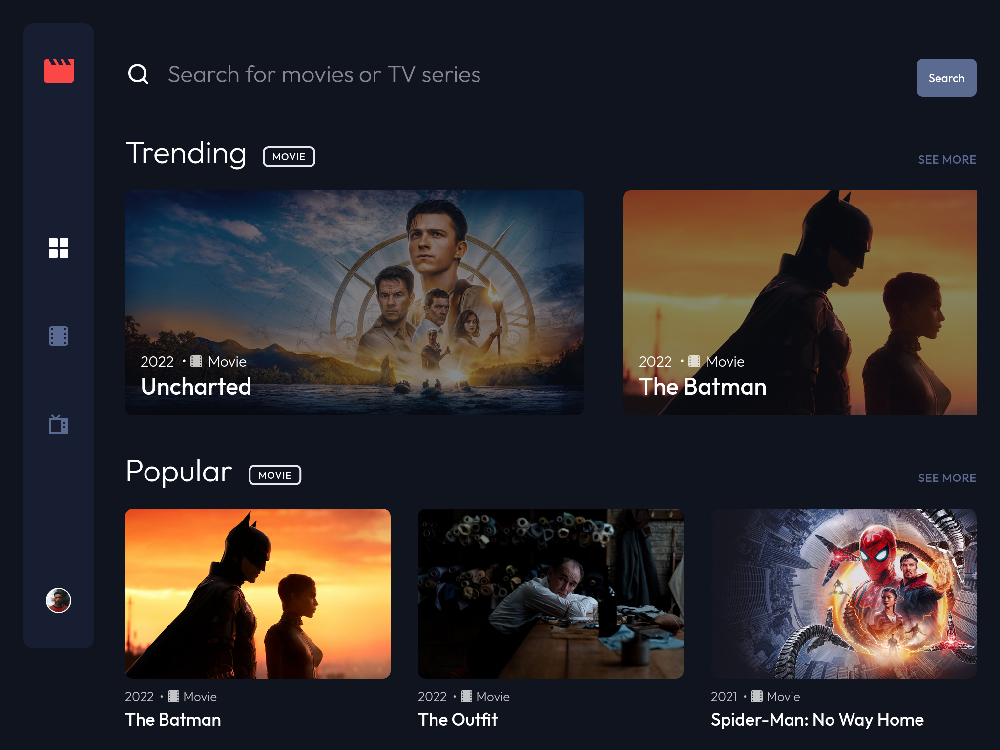
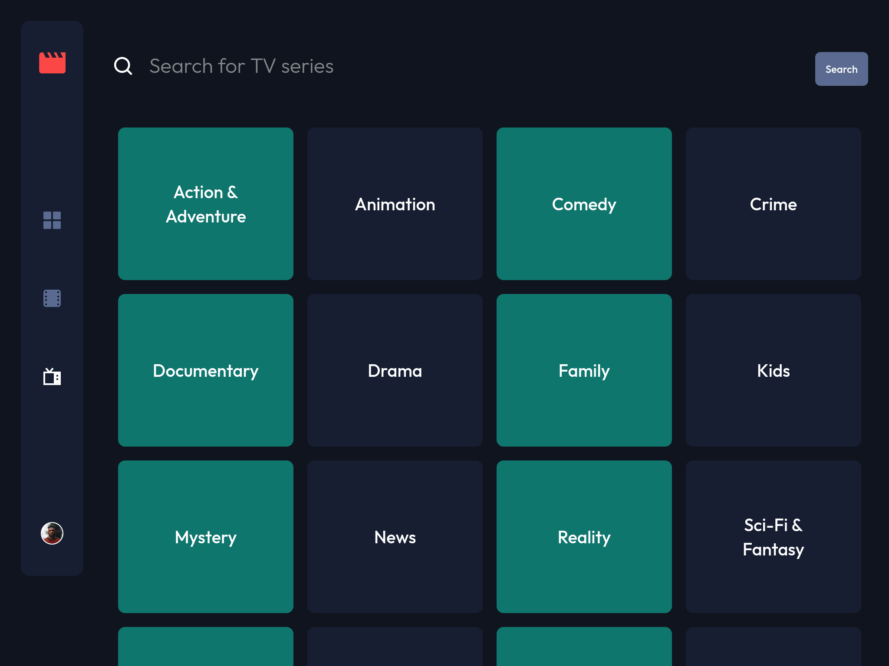

# Entertainment web app

## Table of contents

- [Entertainment web app](#entertainment-web-app)
  - [Table of contents](#table-of-contents)
  - [Overview](#overview)
    - [Summary](#summary)
    - [Screenshot](#screenshot)
    - [Links](#links)
  - [Details](#details)
    - [Project purpose and goal](#project-purpose-and-goal)
    - [Web stack and explanation](#web-stack-and-explanation)
    - [Problem and thought process](#problem-and-thought-process)
    - [Lesson learned](#lesson-learned)
    - [Future improvements](#future-improvements)
    - [Useful resources](#useful-resources)
  - [Getting started](#getting-started)
    - [Prerequisites](#prerequisites)
    - [Installing](#installing)
  - [Contributing](#contributing)
  - [Author](#author)
  - [Acknowledgments](#acknowledgments)

## Overview

### Summary

An entertainment web app that built with Next.js and TailwindCSS. It allows users to search for movies and tv shows.

### Screenshot







### Links

- Solution URL: [GitHub](https://github.com/hooiyan/fem-entertainment-web-app)
- Live Site URL: [Netlify](https://hy-entertainment.netlify.app/)

## Details

### Project purpose and goal

The main purpose of this project is to take advantages of the capabilities of Next.js and have a functional web app up and running quickly. Secondly, I want to become familiar with the framework itself and its convenient features.

### Web stack and explanation

- Semantic HTML5 markup
- Flexbox
- Mobile-first workflow
- [Next.js](https://nextjs.org/)
- [TailwindCSS](https://tailwindcss.com/)
- [useSWR](https://swr.vercel.app/)

I love using Next.js because it makes building apps a smoother experience for developers. I think writing CSS inline with HTML is convenient within components. Therefore, I chose to pair TailwindCSS - a utility-first CSS framework with Next.js for styling the user interfaces. The file-system based router built into Next.js allows me to create static and dynamic pages easily. Beside using the built-in API solution provided by Next.js, I also use SWR for client-side data fetching. The data population of this app is powered by TMDB API. The stack that I chose has one thing in common, which is that they all have good written documentations that I can look up easily whenever I encounter a specific problem.

### Problem and thought process


### Lesson learned

### Future improvements


### Useful resources

- [Example resource 1](https://www.example.com) - This helped me for XYZ reason. I really liked this pattern and will use it going forward.
- [Example resource 2](https://www.example.com) - This is an amazing article which helped me finally understand XYZ. I'd recommend it to anyone still learning this concept.

## Getting started

These instructions will get you a copy of the project up and running on your local machine for development and testing purposes.

### Prerequisites

1. Create an API KEY for the [TMDB API](https://www.themoviedb.org/documentation/api)
2. Create an `.env.local` file in the root directory of the project
3. Add 2 environment variables to the `.env.local` file:
```env
// .env.local

TMDB_ENDPOINT="https://api.themoviedb.org/3"
TMDB_API_KEY="YOUR_TMDB_API_KEY"
```

### Installing

Clone the repository and run the development server:
```bash
npm install
npm run dev
# or
yarn install
yarn dev
```

## Contributing

Please feel free to send pull request if you want to contribute!

## Author

- Website - [hooiyan](https://hooiyan.com)
- Frontend Mentor - [@hooiyan](https://www.frontendmentor.io/profile/yourusername)

## Acknowledgments

- [Fazza Razaq Amiarso](https://www.frontendmentor.io/profile/fazzaamiarso) - Thank you Fazza for helping me with the pagination implementation.
- [Oluwamuyiwa Samuel Adepoju](https://www.frontendmentor.io/profile/codermuyi) - Thank you Muyi for reminding me the accessibility issues.
