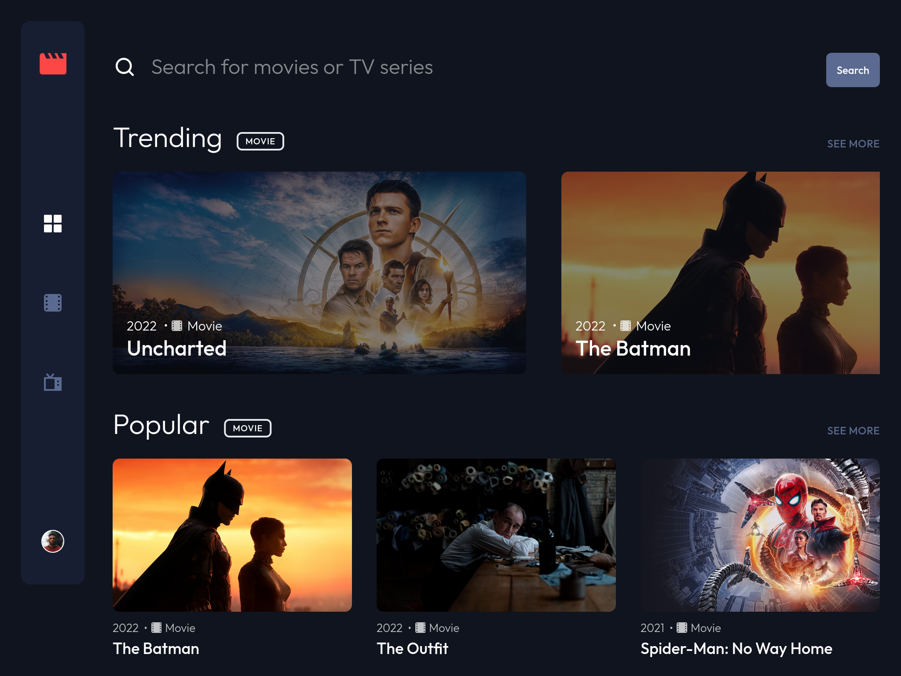
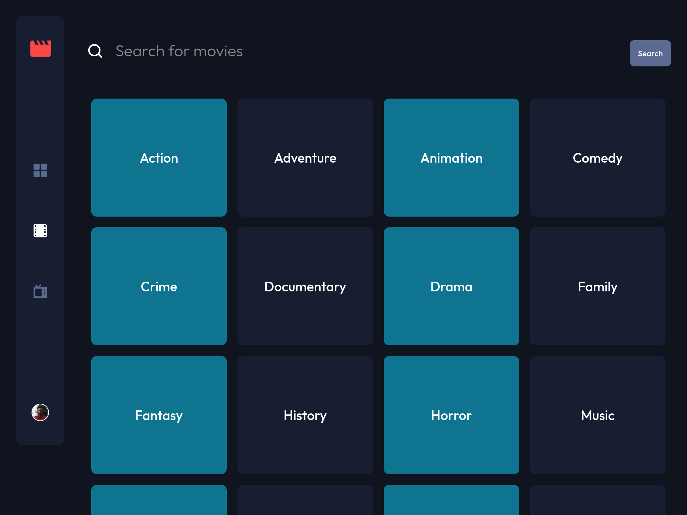
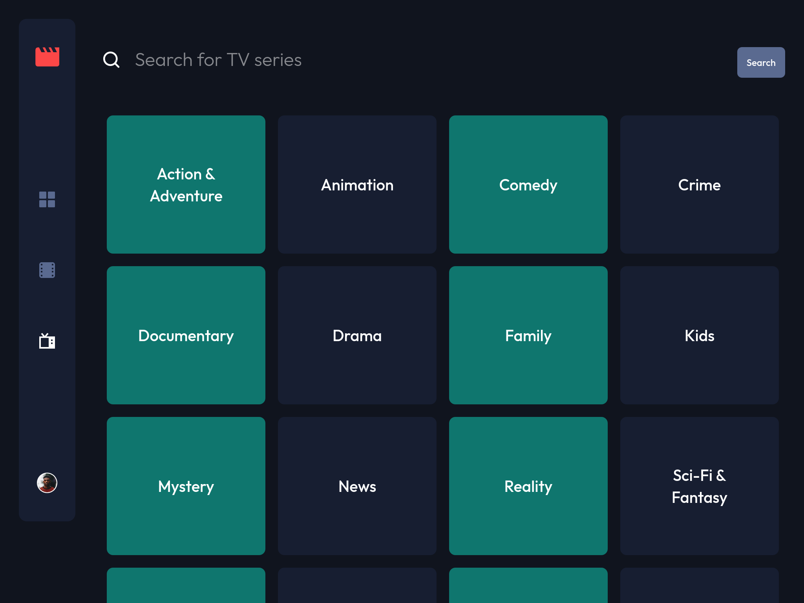
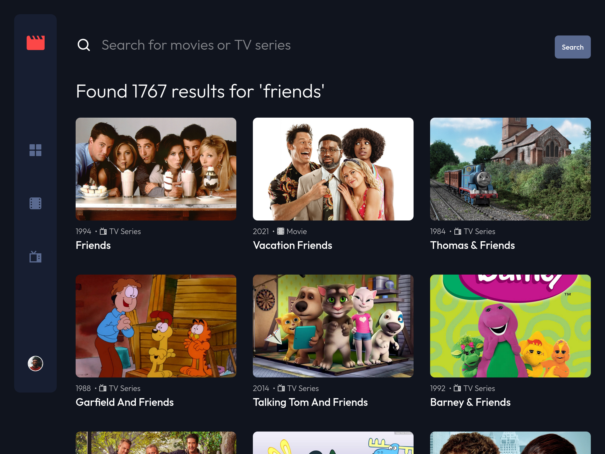

# Entertainment web app

## Table of contents

- [Entertainment web app](#entertainment-web-app)
  - [Table of contents](#table-of-contents)
  - [Overview](#overview)
    - [Summary](#summary)
    - [Screenshot](#screenshot)
    - [Links](#links)
  - [Details](#details)
    - [Project purpose and goal](#project-purpose-and-goal)
    - [Web stack and explanation](#web-stack-and-explanation)
    - [Problem and thought process](#problem-and-thought-process)
    - [Lesson learned](#lesson-learned)
    - [Future improvements](#future-improvements)
    - [Useful resources](#useful-resources)
  - [Getting started](#getting-started)
    - [Prerequisites](#prerequisites)
    - [Installing](#installing)
  - [Contributing](#contributing)
  - [Author](#author)
  - [Acknowledgments](#acknowledgments)

## Overview

### Summary

An entertainment web app that built with Next.js and TailwindCSS allows users to search for movies and tv shows.

### Screenshot









### Links

- Solution URL: [GitHub](https://github.com/hooiyan/fem-entertainment-web-app)
- Live Site URL: [Netlify](https://hy-entertainment.netlify.app/)

## Details

### Project purpose and goal

The main purpose of this project is to take advantages of the capabilities of Next.js and have a functional web app up and running quickly. Secondly, I want to become familiar with the framework itself and its convenient features.

### Web stack and explanation

- Semantic HTML5 markup
- Flexbox
- Mobile-first workflow
- [Next.js](https://nextjs.org/)
- [TailwindCSS](https://tailwindcss.com/)
- [useSWR](https://swr.vercel.app/)

I love using Next.js because it makes building apps a smoother experience for developers. I think writing inline CSS with HTML is convenient within components. Therefore, I chose to pair TailwindCSS - a utility-first CSS framework with Next.js for styling the user interfaces. The file-system based router built into Next.js allows me to create static and dynamic pages easily. Beside using the built-in API solution provided by Next.js, I also use SWR for client-side data fetching. The data population of this app is powered by TMDB API. Each technology in the stack has one thing in common, which is that they all have well-written documentations.

### Problem and thought process

Although this is not a particularly big project, I still think it is a good practice to have an organized project structure as well as reusable components that could be used in multiple places. This project got me thinking mostly about which method should I opt for fetching data from the API. Next.js provides different ways for data fetching depending on our needs. They do also suggest developers the ideal situation to use them. For me, I combined all of them in different parts of the application. 

### Lesson learned

I could not count how many lessons that I have learned from building this application. However, there are 3 most important lessons that I got out of it.

1. Using `useSWR` to implement pagination in the search result pages and the "see more" pages.
2. Be careful to not expose the secret keys that we store as environment variables. Initially, I fetched the data from the API directly on the client-side, I have exposed the API key to the client, I could see the key when I opened up the network tab in the dev tool. This is risky and should be avoided. Later on, I changed the method and fetch the data from the server side so that the secret key could be hidden from the user.
3. Have a better understanding of the error `Cannot read Property 'slice' of Undefined`. Whenever we need to fetch the data from external API, we should make sure that the data exists before we use it in our application. Let say we want an array of movies to be rendered to the UI, but the data is not available yet. According to [this article](https://bobbyhadz.com/blog/javascript-cannot-read-property-slice-of-undefined), we have various solution for this error. The one that I find easiest to understand is to provide an empty fallback value like so: `const arr = data.slice(0, 10) || []`.

### Future improvements

- [ ] Add a bookmark page to store the user's favorite movies and tv shows
- [ ] Add the video playing feature when the user hover over the card and play the video
- [ ] Add authentication so that the user can sign up and log in to save their favorite movies and tv shows permanently
- [ ] Adjust the size of the card item in the last row so that the image won't be stretched out

### Useful resources

- [Solution for Cannot read Property 'slice' of Undefined](https://bobbyhadz.com/blog/javascript-cannot-read-property-slice-of-undefined)
- [How to get all available pages in the same request?](https://www.themoviedb.org/talk/55aa2a76c3a3682d63002fb1?language=en)

## Getting started

These instructions will get you a copy of the project up and running on your local machine for development and testing purposes.

### Prerequisites

1. Create an API KEY for the [TMDB API](https://www.themoviedb.org/documentation/api)
2. Create an `.env.local` file in the root directory of the project
3. Add 2 environment variables to the `.env.local` file:
```env
// .env.local

TMDB_ENDPOINT="https://api.themoviedb.org/3"
TMDB_API_KEY="YOUR_TMDB_API_KEY"
```

### Installing

Clone the repository and run the development server:
```bash
npm install
npm run dev
# or
yarn install
yarn dev
```

## Contributing

Please feel free to send pull request if you want to contribute!

## Author

- Website - [hooiyan](https://hooiyan.com)
- Frontend Mentor - [@hooiyan](https://www.frontendmentor.io/profile/yourusername)

## Acknowledgments

- [Fazza Razaq Amiarso](https://www.frontendmentor.io/profile/fazzaamiarso) - Thank you Fazza for helping me with the pagination implementation.
- [Oluwamuyiwa Samuel Adepoju](https://www.frontendmentor.io/profile/codermuyi) - Thank you Muyi for reminding me the accessibility issues.
